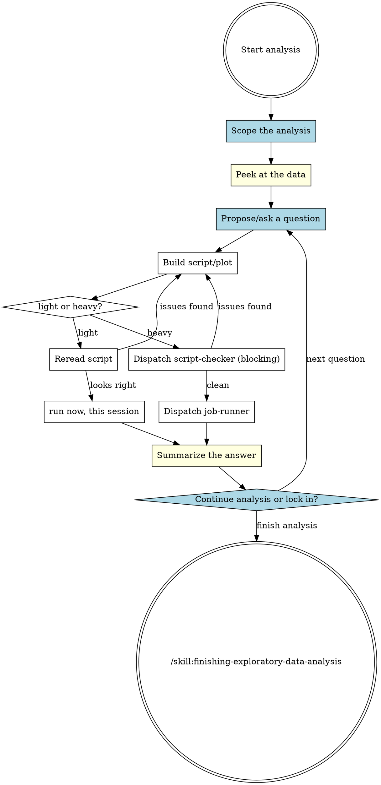

# Workflow

Loop/flow-control for `/skill:exploring-data`.

The user drives this loop: they propose or pick the next thing to plot or
check, you build it and return what it shows. They then interpret it
and pick next steps or ask additional questions.

This is a looped pipeline, exiting only when the user decides to
lock-in an analysis.

(blue = User turn, yellow = Agent -> User handoff, white = Agent-only)

| Stage | Turn | What it looks like | See |
| --- | --- | --- | --- |
| Scope the analysis | User | State the broad scope/question area for this analysis and confirm it, once per analysis, before touching data | `pre-code-checkpoints.md` (Scope the analysis) |
| Peek at the data | Agent -> User | Schema/dtypes, `.head()`, a sample, eyeball raw rows, hand back for a look | `pre-code-checkpoints.md` (Peek at the data) |
| Propose/ask a question | User (agent may suggest) | Confirm framing for the next question, then the user picks what to plot or check | `pre-code-checkpoints.md` (Propose/ask a question) |
| Build script/plot | Agent | Write the script/plot, smoke test on a subset before scaling | `checking-and-running-scripts.md`, `plotting.md` |
| light or heavy? | Agent | Judge from the smoke-test timing/size ratio | `checking-and-running-scripts.md` |
| Reread script | Agent | Light: reread the script yourself before running -- no `script-checker` dispatch, loop back to the script on issues you find | `checking-and-running-scripts.md` |
| Dispatch script-checker (blocking) / Dispatch job-runner | Agent | Heavy: dispatch the `script-checker` and wait; loop back to the script on findings; don't launch the `job-runner` until it's clean | `checking-and-running-scripts.md` |
| Summarize the answer | Agent -> User | Interpret the figure/stats as a summary, not a conclusion -- the user decides what it means and what's next | `SKILL.md` Core principle |
| Lock-in checkpoint | User | Figure/analysis seems meaningful, ready to write up or commit | `/skill:finishing-exploratory-data-analysis` |

## Common Mistakes

| Mistake | Fix |
| --- | --- |
| Treating any issue in scripts (via self-reread or `script-checker`) as a note to fold in later instead of a loop back to the script | Go to "Build script/plot" and fix it -- see the graph's "issues found" edges |
| Launching a heavy scale-up while the `script-checker` is still pending or has open findings | See `checking-and-running-scripts.md`'s Common Mistakes |
